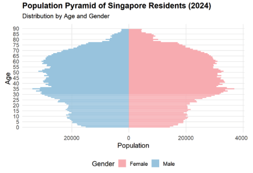
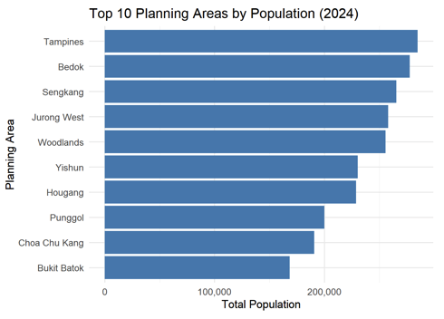
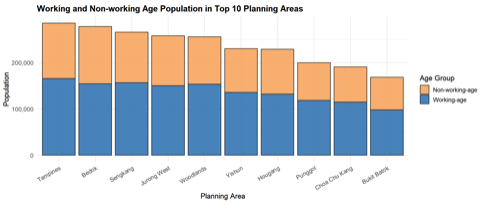

# Objectives of the Assignment

I will be providing a critique of the visualisation created by my classmate, Wang Anqi. This critique will highlight 3 strengths and 3 areas for improvement in her visualisation. Following the critique, I will present a redesigned version of the visualisation based on the feedback provided.

Link to Anqi's Assignment: https://isss608-25t3-anqi.netlify.app/take-home_ex/take-home_ex01/take-home_ex01

# My Critique



Strength 1: 

Anqi presented the population distribution of Singapore Residents using a population pyramid, with males on the left and females on the right. This is a commonly used method for visualising a country's population structure by age group, offering a clear and intuitive overview.

Area of Improvement 1:

Anqi did not group the ages into bins, which makes the visualisation harder to interpret for readers who are interested in specific age ranges.



Strength 2:

Anqi sorted the Planning Areas in descending order of population, making the visualisation easier to read and interpret.

Area of Improvement 2:

Readers are unable to determine the exact population of each Planning Area, as there are no tooltips or data labels displayed in the visualisation.



Strength 3:

Anqi used a stacked bar chart to clearly show the proportion of the working and non-working age population, allowing readers to grasp the breakdown at a glance.

Area of Improvement 3:

Similarly, readers are unable to discern the exact values in the stacked bar charts, as there are no tooltips to display this information.

# Codes to Re-create Anqi's Visualisations

```{r}
pacman::p_load(tidyverse, ggrepel, patchwork, 
               ggthemes, hrbrthemes,) 
               
popu_data <- read_csv("data/respopagesex2024.csv", show_col_types = FALSE)

cat("Total number of records in the dataset:", nrow(popu_data), "\n")

# Remove the 'Time' column from the dataset
popu_data1 <- popu_data %>% select(-Time)

# Checks for NA in each column
colSums(is.na(popu_data1))

# Here's what the dataset looks like so far
popu_data1

# Step 1: Recode "90 and over" to "90"
popu_data1 <- popu_data1 %>%
  mutate(Age = ifelse(Age == "90 and over", "90", Age))

# Step 2: Convert Age to integer
popu_data1 <- popu_data1 %>%
  mutate(
    Age = trimws(Age),
    Age = ifelse(Age == "90 and over", "90", Age),
    Age = as.integer(Age)
  )

popu_data1 <- popu_data1 %>%
  mutate(
    Sex = recode(Sex, "Males" = "Male", "Females" = "Female")
  )

# Here's what the dataset looks like so far
popu_data1
```


